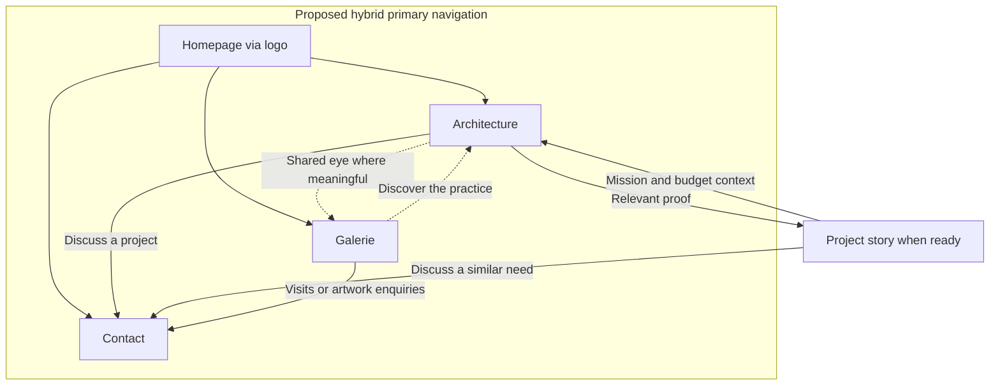

# Jukkai — working website content plan

**Working proposal for Martin, 10 September 2026; updated with a site-architecture
review.** The developing website, with one Architecture page as a sample. Pages,
offers, copy, imagery and release scope remain unapproved. The review below makes
navigation and contextual relationships explicit without selecting the final pages.

The [foundation](../../strategy/foundation.md) supplies business truth;
[current delivery](../../operations/current-delivery.md) separates magazine release
from October opening. This connects the [visitor explanations](visitor-content-brief.md),
[sitemap comparison](sitemap-options-memo.md) and [architecture brief](architecture-content-proof-brief.md).

## How people arrive and continue

- **Magazine, referral or Studio Terrasson visitor:** homepage → recognise
  Crystelle, Jukkai and both activities → relevant explanation or direct contact.
- **Someone looking for help:** Architecture or a relevant project → understand
  design choices, mission and budget implications → discuss their own situation.
- **Art visitor from Instagram, search or a shared link:** Galerie → actual works
  and selection perspective → visiting/enquiry information. Architecture remains
  an available discovery.

These are journeys to support, not measured funnels. A project visitor should
understand Jukkai and reach relevant help/contact without going through the homepage.

## Recommended starting structure

**Start with hybrid:** Homepage, Architecture, Galerie and Contact, adding individual
project stories as their material becomes useful and ready. These are content
destinations, not final navigation labels or URL choices.

Architecture and Galerie answer different questions. Within Architecture, mission,
budget and process explanations can serve several project types without repetition.
Explicit conseil and professional sections and links should give each visitor a
recognisable route. Shared professional identity alone does not justify combining pages.

| Destination                   | Visitor problem                                           | Proposed content and continuation                                                                                                                                                                                    |
| ----------------------------- | --------------------------------------------------------- | -------------------------------------------------------------------------------------------------------------------------------------------------------------------------------------------------------------------- |
| **Homepage**                  | “What is Jukkai, is this Crystelle, and why explore?”     | Shared identity, Châteaugiron place, Studio Terrasson continuity, selected interior, people and art. Architecture receives meaningful proof; Galerie has its own invitation. Continue to either activity or contact. |
| **Architecture**              | “Is my project relevant, and how would we work together?” | Residential/professional needs, design choices, missions, works/fees and first conversation. Continue to a relevant case or contact. Sample below.                                                                   |
| **Galerie**                   | “What could I discover or buy, and can I come?”           | Actual works, verified captions, selection perspective, buying/enquiry process and separate public-opening state. Continue to visiting/contact information; a quiet artist route.                                    |
| **Contact / visit**           | “How do I reach you, and what happens next?”              | Verified address/channels, useful project information, appointment process and distinct Galerie visiting information. Phone stays easy to reach; Martin chooses the hierarchy.                                       |
| **Project stories, as ready** | “What did you contribute to a situation like mine?”       | Brief, constraint, choices and supported outcome, with images/plans and credits. Creative name plus descriptive subtitle; links to Architecture and enquiry.                                                         |

Introduce Crystelle and Laura within the homepage and Architecture first. A fuller
studio story, cost/process guide or portfolio index can earn a page later.
Geography belongs in practice/contact information; extra town or sector pages need
distinctive content and proof. No blog programme is assumed.

**Strongest alternative: separate Conseil/décoration and Espaces professionnels
entrances.** This becomes stronger when a defined conseil offer earns a specific
explanation, or professional needs become obscured by residential content.
Those pages could serve search, referrals and sharing; they require distinct
writing and proof to avoid repeating the same offer.

Test whether the proposed conseil and professional content gives clear enough
routes. For the magazine, a rich homepage plus useful contact remains a credible
subset; the developing model does not require four pages before publication.

## Architecture review — consequential gaps in the proposed routes

These are **agent recommendations from the visitor brief**, not observed usability
failures. The content purposes above remain useful; the main omissions are how
people find the relevant explanation and continue from it.

| Gap or confusing route                                                                         | Visitor consequence and basis                                                                                                                                                                                                                                                                                                                                            | Proposed improvement                                                                                                                                                                                                                                   |
| ---------------------------------------------------------------------------------------------- | ------------------------------------------------------------------------------------------------------------------------------------------------------------------------------------------------------------------------------------------------------------------------------------------------------------------------------------------------------------------------ | ------------------------------------------------------------------------------------------------------------------------------------------------------------------------------------------------------------------------------------------------------ |
| Conseil and professional coverage is named, but its entrances are unspecified.                 | Someone seeking focused help or a workplace transformation may read “Architecture” as residential renovation only ([brief §§2, 5](visitor-content-brief.md#2-does-her-work-appeal-to-me-and-can-she-help-with-my-project)).                                                                                                                                              | Give both needs explicit links from relevant homepage content and a short contents navigation within Architecture. In hybrid these reach named sections; in separated they reach the corresponding pages. Test the same needs before choosing a split. |
| Project stories link broadly to Architecture, without specifying which explanation helps next. | A visitor attracted by a design still needs to understand the mission and works/fee distinction ([brief §§3–4](visitor-content-brief.md#3-how-do-my-budget-the-works-and-your-fees-fit-together)).                                                                                                                                                                       | Link each selected case to relevant mission/budget explanations and directly to contact. Link back to that case beside the need or claim it demonstrates. A portfolio index is optional.                                                               |
| “Contact / visit” groups two different intentions without defining their destinations.         | An art visitor could meet a project-only enquiry path or mistake architecture appointments for public Galerie access ([brief §§6–7](visitor-content-brief.md#6-what-will-i-discover-at-the-galerie-and-can-i-buy-it)).                                                                                                                                                   | Keep general Contact understandable for both activities; distinguish architecture enquiries from Galerie visits and artwork enquiries within it. Show opening state on Galerie itself, beside its visit action.                                        |
| The smaller magazine subset has no explicit replacement for unbuilt pages.                     | A magazine reader could find promised destinations unavailable, or lose the Galerie explanation when its page is deferred ([brief §§1, 6–7](visitor-content-brief.md#1-what-is-jukkai-and-is-this-the-crystelle-i-know)).                                                                                                                                                | Route to useful published homepage sections and contact information until separate pages are ready. Preserve recognition, both activities and their different availability states in that subset.                                                      |
| The existing contact card is absent from the relationship model.                               | A printed-card visitor and a general enquiry visitor have different immediate jobs; treating the card as the whole Contact experience would lose mission/visit guidance ([brief §7](visitor-content-brief.md#7-where-are-you-can-i-come-and-how-do-we-start), [delivery brief](../../operations/current-delivery.md#two-milestones-with-a-separate-migration-decision)). | Retain the quick save/call route, connect it to the useful website, and expose it contextually from general contact information. Preserve the printed pointer.                                                                                         |

### Proposed navigation and destination relationships

**Header:** logo → homepage; then **Architecture intérieure**, **Galerie**,
**Contact** as draft labels/order for hybrid. “Galerie” is the established public
category; the other labels and their visual treatment are proposals. Keep the global
contact label usable for both activities; **« Parlons de votre projet »** belongs
beside architecture content. Phone remains directly available without requiring an
offer, project or audience selection. Its prominence and the channel hierarchy
remain Martin's choice.

Within Architecture, propose short, descriptive section links for **Habitat**,
**Conseil / décoration**, **Espaces professionnels**, **Missions**, and
**Budget et honoraires**, where the corresponding content is developed. A professional
or conseil visitor should be able to enter at that section from the homepage or a
shared link. This contents navigation does not prescribe the page's visual sequence
or require a separate page for every item. Use the same destinations in mobile
navigation; essential routes must work without hover.

**Footer:** repeat the published activity/contact routes, verified contact/address
information, Instagram and the applicable legal/privacy information. Provide a clear
Galerie visiting link with its current opening state. Avoid a town/sector link list
without useful destinations. Crystelle/Studio Terrasson continuity and the people
introduction remain accessible within homepage/Architecture content; they do not
depend on an About page. The quiet artist contact belongs in Galerie content, outside
primary navigation.

| Destination               | URL status                                                           | Hierarchy and access in the proposed hybrid                                                                                                      |
| ------------------------- | -------------------------------------------------------------------- | ------------------------------------------------------------------------------------------------------------------------------------------------ |
| Homepage                  | `/`                                                                  | Root; logo link on editorial pages.                                                                                                              |
| Architecture              | URL open                                                             | Primary destination from homepage/header; owns the shared mission/budget explanations and conseil/professional sections while combined.          |
| Galerie                   | `/galerie/` is the existing proposed URL, not a release commitment   | Primary destination from homepage/header; independent visit and artwork-enquiry routes.                                                          |
| General Contact           | URL open; distinct from the contact card                             | Primary destination from header/footer and contextual actions; architecture and Galerie information separately reachable.                        |
| Individual project story  | URLs open                                                            | Contextually connected to Architecture and the relevant need; selected homepage features may also link in. An index and its URL remain optional. |
| Crystelle contact card    | Existing `/contact/crystelle`; printed `/c/crystelle` pointer locked | Utility destination from printed cards and a secondary contact link; not an additional primary-nav item.                                         |
| Legal/privacy information | Destinations to confirm for the chosen implementation                | Footer access; account for these alongside the editorial subset.                                                                                 |

The diagram shows proposed links, **not URL nesting or approved release pages**.
Section-level links are specified below. “Contact” includes separate architecture
and Galerie information even if they share one page.

Use descriptive contextual returns from cases, such as **« Comprendre la mission »**,
to the relevant Architecture section. A flat first site needs no sidebar or automatic
breadcrumb on every page. If a project index or deeper section is later adopted,
breadcrumbs can show its real published hierarchy; do not link a breadcrumb to an
unbuilt `/projets/` parent or infer parent pages from URL segments. Final slugs and
slash handling belong with the chosen page model and existing routing conventions.

### Contextual links that carry the visitor's question forward

- **Homepage → relevant need:** link the focused-mission welcome to the conseil
  explanation and professional-use proof to professional content. Keep Crystelle's
  identity and the Studio Terrasson connection understandable before those exits.
- **Need → proof → explanation:** where a relevant case is ready, link it beside
  the Architecture need it demonstrates. In the case, name Crystelle/Jukkai and the
  contribution, link to the relevant mission and budget sections, and offer contact
  directly. A case does not need a detour through the homepage or an index.
- **Budget → conversation:** make **« Budget et honoraires »** findable from the
  Architecture contents and a relevant case decision. Explain works and fees there;
  offer contact for the visitor's own situation without requiring a finished budget
  or a public tariff page. Detailed amounts remain subject to the existing proof rules.
- **Galerie → visit or enquiry:** place visiting information and opening state beside
  the invitation to come. An artwork enquiry should identify the work/artist where
  verified and lead to a suitable direct channel or Galerie contact section, with
  no architecture questionnaire. A quiet **« Vous êtes artiste ? »** route can use
  that channel too; it needs no dedicated page.
- **Architecture ↔ Galerie:** offer the other activity beside the shared-eye/selection
  explanation where it adds meaning. These are optional discoveries. Buying/viewing
  art is a complete journey of its own; this link does not establish an art-placement
  service or require art buyers to become architecture prospects.
- **Contact ↔ card:** a secondary **« Enregistrer les coordonnées de Crystelle »**
  link can reach the existing card. Keep its save/call actions immediate and a clear
  onward route to the homepage when useful content is published. Follow the
  [contact-card contract](../../operations/crystelle-contact-card.md); the printed
  `https://jukkai.fr/c/crystelle` payload stays unchanged.

### Keep the paths useful as pages change

For an **integrated magazine subset**, Architecture/Galerie links target actual
homepage sections; Contact reaches the chosen contact page or section. From any
other page, section links must include the homepage path. Use a case excerpt in
place when no full story is published; do not make an image promise a missing case
page. If visiting details are unconfirmed, state the known opening position and
offer an enquiry route without implying walk-in access.

For a **later split**, change conseil/professional links to their chosen destinations
and leave concise introductions in Architecture. Give each new page a distinct
question and relevant proof; link to shared mission/budget content instead of copying
it wholesale. Each published story needs an incoming editorial link and useful
onward links, even without an index. Revisit shared section links when content moves.

**Review with actual drafts:** start as a magazine/referral visitor, someone seeking
focused conseil, a professional visitor, a person entering directly at a case, an
art visitor and a printed-card visitor. Check whether each can recognise Jukkai,
find the relevant explanation and act without backtracking through an unrelated
activity. Inspect header/footer, contextual links and section targets on mobile
and with a keyboard. This is a proposed acceptance check; no rendered pages or live
links were tested in this document review. Failure to find conseil/professional help
would be evidence for clearer entrances or a page split, not automatic approval of one.

The [old-site preservation review](sitemap-options-memo.md#continuity-to-preserve-while-choosing-pages)
still owns linked article/project candidates. Keep that review separate from this
navigation model: deferring a Jukkai page does not approve redirecting its old-site
counterpart to the homepage, or starting the migration.

## What supports this proposal

**Business:** substantial residential/professional work and smaller missions are
established directions. Martin's account of budget concerns gives that explanation
practical weight, without fixing visual hierarchy.

**Research:** homepage concentration in the small old-site [GSC sample](../../research/seo-research-log.md#8-studio-terrasson-gsc--what-already-attracts-search-visits)
supports recognition and continuity. The September 8–10 Rennes/desktop
[service comparison](../../research/seo-research-log.md#44-service-query-overlap--which-needs-warrant-combined-or-distinct-treatment)
found closer overlap within architecture phrases and within décoration/aménagement/
conseil phrases than between them. That supports considering a separate entrance;
the words do not identify small budgets. Saved CKTFC/Anata readings demonstrate
ways to connect decisions, deliverables and contact
([application](architecture-content-proof-brief.md#applying-the-practice-comparisons)).

**Editorial judgment:** hybrid and the treatments below are recommendations;
research proves neither conversion nor a preferred page count.

## Architecture — one developed page brief

**Job:** help a prospective client recognise suitable work and understand the
collaboration enough to enquire, whatever their entrance.

This sequence is not a fixed layout. Budget deserves a substantive answer; its
importance does not make it the headline, largest block or first reading step.
Design can weave a budget decision into a case and link to the explanation.

### Recognise the work and a desirable project

Possible opening, **draft French**:

> Repenser votre intérieur, de ses usages à ses détails.
> Installé à Châteaugiron, le studio accompagne vos projets d'architecture
> intérieure à Rennes et dans sa région.

Pair a selected image with a meaningful design choice; introduce Crystelle and
Laura accurately. Let the work demonstrate ambition rather than a “haut de gamme” claim.

For **residential visitors**, show rooms that no longer fit daily life, several
uses to accommodate, or furnishing carried through in detail. Proposed desirable
client fit: seeking a considered design response and willing to discuss priorities,
constraints and budget. Refine this with Crystelle; it establishes no minimum budget.

For **professional visitors**, name the activity and users: how people work,
circulate, wait or are welcomed. Show the contribution and collaborators. Proposed
fit is work where design serves the place's uses and identity; Crystelle identifies
the commissions she wants more of. Search alone establishes no sector priority.

### Show what a mission changes and delivers

Explain conception, technical preparation and chantier follow-up through an actual
plan or material study: what it helps decide, what Crystelle provides and what
remains with the client.

> La mission précise ce que nous concevons, préparons et suivons, ainsi que les
> décisions et démarches qui vous reviennent.

Separate project size from accompaniment: furnishing can be substantial, and a
smaller space can require careful design. Welcome focused help through the established
frame « une mission déco avec l'exigence d'une architecte d'intérieur ». Exact
name, inclusions, exclusions and fee basis still need current terms.

### Make the budget understandable

Martin reports an expectation gap: people picture their envelope funding a finished
interior, then necessary work leaves less for visible changes. Proposed explanation:

> Rénover un intérieur, c'est aussi intervenir sur ce qui ne se voit pas. Selon
> l'état du logement, l'électricité, la plomberie ou l'isolation peuvent mobiliser
> une part importante du budget. Travaux, aménagements et honoraires doivent être
> envisagés ensemble pour choisir les transformations qui comptent le plus pour vous.

Support this with a real choice and distinguish fees from works. Current letters
of mission must supply any published range, fixed fee or exclusion; cleared figures
need date and scope. An account without amounts is useful. No standard allocation
or savings promise is implied.

### Give confidence and a clear next step

Connect proof to the work: UNAID qualification, Crystelle's “30 ans de métier”,
a source-checked review if ready. Explain the mission agreement and collaboration
with an architect through an actual responsibility split. Insurance wording follows
current cover.

End with **« Parlons de votre projet »**, also accessible earlier. Invite the place,
desired change, timing and budget questions; they need not all be resolved.
Confirm the first-call sequence and mission-dependent travel before publishing.

## Material to develop

- **Residential:** [Belle Époque's saved text](../../reference/studioterrasson/particulier--belle-epoque/content.md)
  explains tiles protecting parquet around the kitchen island: a choice to verify,
  without the full brief, mission or budget. Buisine is a broader furnishing/detail
  candidate in the [proof bank](../../strategy/foundation.md#10-proof-bank).
- **Professional:** [Orange Dynamique's saved text](../../reference/studioterrasson/professionnel--orange-dynamique/content.md)
  describes offices around a central module; user need and scope remain to recover.
  Le Capri offers a possible returning-client story, with new facts/images needed.
- **People and Galerie:** the [local shoot review](../../../website-asset-inbox/photo-shoot-review-2026-09-09/README.md)
  contains provisional portraits/artworks, not a completed Galerie. This gitignored
  material needs Martin's image selection and verified artwork identity,
  sale-selection status and artist consent.

Recover selected cases' brief, role, important choice, supported result and usable
image/plan with credits and permission. Missing figures need not block the story.
For Galerie, prepare selection reasons and buying/visiting facts when developing
that brief: no catalogue, pre-opening prices or unconfirmed public access.

## A small working discussion with Crystelle

Bring the draft, candidate images and current design-only/full-mission letters.
Martin prepares known facts; Crystelle corrects explanations and supplies gaps.

1. **Choose work we want more of.** Start with: « Montrons un logement dont vous
   avez repensé les usages ou les détails, et un lieu professionnel où votre
   intervention répond à un besoin précis. » Compare Belle Époque/Buisine and
   Orange Dynamique/Le Capri, or her better alternatives. Identify what made the
   work/client relationship a good fit and which choice she would explain. Leave
   with one residential and one professional story candidate.
2. **Try the budget explanation.** Read the paragraph, then recount one project:
   initial ambition → necessary work → choice made → fees explained. Leave with a
   corrected explanation and disclosure limits; numbers are optional.
3. **Make accompaniment concrete.** Put a plan beside the responsibilities sentence:
   « Si le client s'arrête après la conception, avec quoi repart-il et que doit-il
   organiser lui-même ? Qu'ajoutez-vous dans une mission complète ? » Use the
   letters to record deliverables, boundaries and remuneration, including one
   focused déco mission. Clarify architect collaboration through a real case.
4. **Rehearse first contact.** Offer: « Vous nous racontez le lieu, ce que vous
   souhaitez changer et vos contraintes ; nous précisons ensemble la suite. »
   Have her correct the post-call sequence, when a meeting is offered and how
   mission/location affect travel. Leave with a short truthful contact explanation.

Martin can now assess the structure, sample brief and candidate stories before
more page drafting. Conseil/B2B separation, visual hierarchy, exact copy and the
magazine subset stay open. Accepted choices belong in the
[page/content decision](https://github.com/martinmoradi/jukkai/issues/85);
old-site preservation and migration retain their [separate review](sitemap-options-memo.md#continuity-to-preserve-while-choosing-pages).
